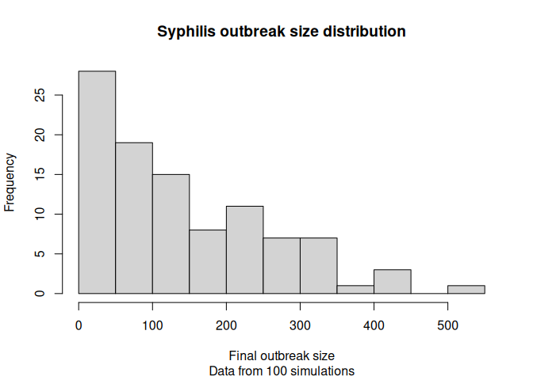

# SOAR Syphilis Modeling

SOAR collaborative research project for modeling syphilis transmission
using R and Python.

## Implementation

The implementation lives in the [`syphilis.hpp`](./syphilis.hpp) and
[`main.cpp`](./main.cpp) files. We are using the `epiworld` C++ library
([link](https://github.com/UofUEpiBio/epiworld)) for the core simulation
engine.

The model implements a simple Syphilis model with the following flow


This model excludes the tertiary stage of syphilis, as it is not
infectious and does not contribute to transmission dynamics (also, it
typically happens decades after the initial infection).

Although `epiworld` allows users using composition for implementing
models, the approach we are using here relies on inheritance, which, to
our opinion, is the best way to build models as we can then reuse them
and share them easily. The `ModelSyphilis` class inherits from the
`epiworld::Model` class, and we implement the necessary methods to
define the model’s behavior.

## Using the model

The implemented model has an example configuration in the `main.cpp`
file:

``` cpp
#include "syphilis.hpp"
#include <cstdlib>

int main(int argc, char* argv[]) {

    // Parse parameters (with defaults)
    float prob_infection     = argc > 1 ? std::atof(argv[1]) : 0.001;
    float incubation_period  = argc > 2 ? std::atof(argv[2]) : 21.0;
    float duration_primary   = argc > 3 ? std::atof(argv[3]) : 52.2;
    float duration_secondary = argc > 4 ? std::atof(argv[4]) : 105.0;
    float duration_latent    = argc > 5 ? std::atof(argv[5]) : 365.0;
    int n_runs               = argc > 6 ? std::atoi(argv[6]) : 100;

    // Creating the model with parameters
    ModelSyphilis model{
        prob_infection,
        incubation_period,
        duration_primary,
        duration_secondary,
        duration_latent
    };

    // Adding agents from small-world network
    model.agents_smallworld(100'000, 10, 0.1);

    // Runing a single simulation for two years
    model.run(365 * 2, 22);

    // We can also run this multiple times
    auto saver = make_save_run(
        "results/%03lu-episimulation.csv",
        true // Total history
    );

    model.run_multiple(365 * 2, n_runs, 22, saver, true, true, 4);

    // Showing what we have so far
    model.print();

    return 0;
}
```

To execute the model, you can run `make main.o` and then `./main.o`. You
should get an output like the following:

``` bash
./main.o
```

    _________________________________________________________________________
    Running the model...
    ||||||||||||||||||||||||||||||||||||||||||||||||||||||||||||||||||||||||| done.
    Starting multiple runs (100) using 4 thread(s)
    _________________________________________________________________________
    _________________________________________________________________________
    ||||||||||||||||||||||||||||||||||||||||||||||||||||||||||||||||||||||||| done.
    ________________________________________________________________________________
    ________________________________________________________________________________
    SIMULATION STUDY

    Name of the model   : Syphilis Model
    Population size     : 100000
    Agents' data        : (none)
    Number of entities  : 0
    Days (duration)     : 730 (of 730)
    Number of viruses   : 1
    Last run elapsed t  : 0.00s
    Total elapsed t     : 1.00s (101 runs)
    Last run speed      : 1484.43 million agents x day / second
    Average run speed   : 5075.65 million agents x day / second
    Rewiring            : off
    Last seed used      : 526637567

    Global events:
     (none)

    Virus(es):
     - Syphilis

    Tool(s):
     (none)

    Model parameters:
     - Days to Detect Infection      : 14.0000
     - Duration of Latent Stage      : 365.0000
     - Duration of Primary Stage     : 52.2000
     - Duration of Secondary Stage   : 105.0000
     - Duration of Treatment         : 21.0000
     - Incubation Period             : 21.0000
     - Prob. Infection               : 0.0010
     - Proportion Will Get Treatment : 0.6667

    Distribution of the population at time 730:
      - (0) Susceptible        :  99999 -> 99906
      - (1) Exposed            :      1 -> 10
      - (2) I. Primary         :      0 -> 18
      - (3) I. Secondary       :      0 -> 15
      - (4) I. Latent          :      0 -> 19
      - (5) I. Latent Terminal :      0 -> 18
      - (6) I. Under Treatment :      0 -> 14

    Transition Probabilities:
     - Susceptible         1.00  0.00     -     -     -     -     -
     - Exposed                -  0.95  0.05     -     -     -     -
     - I. Primary             -     -  0.95  0.01     -     -  0.04
     - I. Secondary           -     -     -  0.99  0.01     -     -
     - I. Latent              -     -     -     -  1.00  0.00     -
     - I. Latent Terminal     -     -     -     -     -  1.00     -
     - I. Under Treatment  0.04     -     -     -     -     -  0.96

## Saved results

The current implementation contains saves the total history when calling
`ModelSyphilis::run_multiple()`. Here is a minor example using the data

``` r
library(data.table)
dat <- list.files("results", full.names = TRUE, pattern = "\\.csv$") |>
  lapply(\(fn) {fread(fn)[, id := fn]}) |>
  rbindlist()

# Figuring out the outbreak size
final_size <- dat[
  date == max(date) & state != "Susceptible",
  .(final_size = sum(counts)),
  by = "id"
  ][, final_size]

# Plotting
hist(
  final_size,
  main = "Syphilis outbreak size distribution",
  xlab = "Final outbreak size",
  ylab = "Frequency",
  sub = sprintf("Data from %d simulations", length(unique(dat$id)))
  )
```


